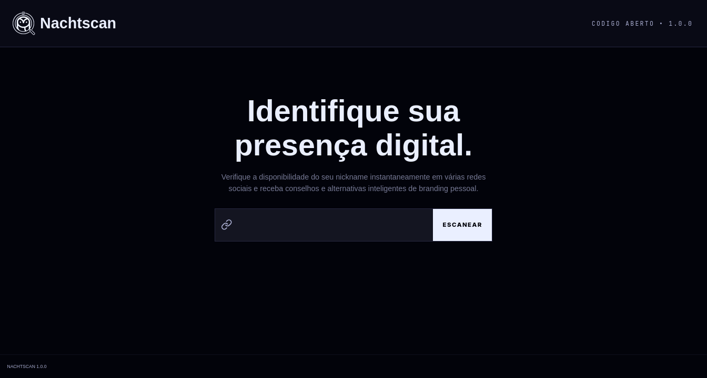
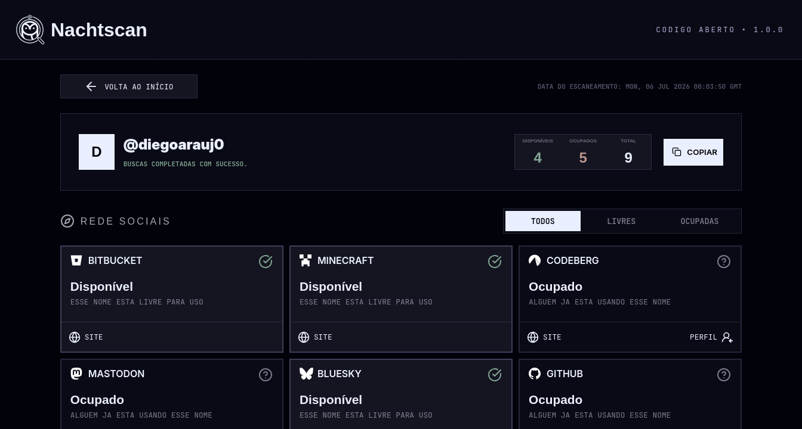

<center>

  # NachtScan

  

  
  
  

  
  
  
  [](#)
  [](#)
  [](#)

</center>

<center>

## 🖼️ Screenshots





</center>

## 📑 Sumário

- [Visão geral](#-visão-geral)
- [Tecnologias](#️-tecnologias)
- [Pré-requisitos](#-pré-requisitos)
- [Instalando o NachtScan](#-instalando-o-nachtscan)
- [Variáveis de ambiente](#-variáveis-de-ambiente)
- [Executando o NachtScan](#️-executando-o-nachtscan)
- [Fontes de busca suportadas](#-fontes-de-busca-suportadas)
- [Licença](#-licença)

## 📚 Visão geral

NachtScan é uma plataforma web que permite verificar, em poucos segundos, se um nickname está disponível ou já está em uso em diversas plataformas na internet (redes sociais, ecossistemas de código, fóruns e jogos).

## 🖥️ Tecnologias

| Tecnologia | Função |
| --- | --- |
| 🌐 **NestJS** | Framework utilizado para criar o backend da aplicação. |
| 🌐 **Angular** | Framework utilizado para criar o frontend da aplicação. |
| 🟥 **Redis** | Banco de dados em memória, usado para cache e persistência mesmo quando a aplicação reinicia. |
| 🟦 **TypeScript** | Linguagem utilizada em toda a aplicação, adicionando tipagem estática e facilitando a manutenção. |

## ✅ Pré-requisitos

Você pode executar o NachtScan de duas formas:

- **🐳 Docker (recomendado)** — apenas Docker e Docker Compose instalados.
- **💻 Localmente** — Node.js, Redis e Git instalados.

### Docker (recomendado)

- Docker
- Docker Compose

### Execução local

- Node.js **v24** ou superior
- Redis (local ou hospedado, como o Redis Cloud)
- Git

## 🚀 Instalando o NachtScan

```bash
# Clone o repositório
git clone [https://github.com/diegoarauj0/nachtscan-web.git](https://github.com/diegoarauj0/nachtscan-web.git)
cd nachtscan-web

# Configure e instale o servidor
cd ./server
cp .env.example .env.development
cp .env.example .env.production
npm install

# Instale o cliente
cd ../client
npm install

cd ../

```

> 💡 Depois de instalar, configure as [variáveis de ambiente](https://www.google.com/search?q=%23-vari%C3%A1veis-de-ambiente) antes de iniciar a aplicação.

## ✍️ Variáveis de ambiente

### Server

⚠️ O servidor procura por dois arquivos de configuração, dependendo do ambiente:

* `/server/.env.development` — utilizado durante o desenvolvimento.
* `/server/.env.production` — utilizado em ambiente de produção.

O arquivo `/server/.env.example` contém valores de exemplo e alguns valores públicos que podem ser expostos sem problemas.

Algumas variáveis possuem **valores padrão**, enquanto outras são **obrigatórias** para que o servidor funcione corretamente.

| Variável | Obrigatória | Descrição | Exemplo |
| --- | --- | --- | --- |
| `PORT` | Não | Porta em que a aplicação será iniciada. | `3000` |
| `REDIS_HOST` | Sim | Host do servidor Redis. | `localhost` |
| `REDIS_PORT` | Sim | Porta do servidor Redis. | `6379` |
| `REDIS_USERNAME` | Não | Usuário para autenticação no Redis. | `default` |
| `REDIS_PASSWORD` | Não | Senha para autenticação no Redis. | `senha123` |
| `ENABLED_SOURCES` | Sim | Lista de provedores habilitados, separados por vírgula. | `github,gitlab,bitbucket` |
| `GITHUB_TOKEN` | Não | Token da API do GitHub. Opcional, mas recomendado para aumentar o limite de requisições. | `ghp_xxxxxxxxx` |
| `GITLAB_TOKEN` | Não | Token da API do GitLab. Opcional, mas recomendado para aumentar o limite de requisições. | `glpat-xxxxxxxx` |
| `BITBUCKET_TOKEN` | Não | Token da API do Bitbucket. Opcional, mas recomendado para aumentar o limite de requisições. | `xxxxxxxx` |
| `CODEBERG_TOKEN` | Não | Token da API do Codeberg. Opcional, mas recomendado para aumentar o limite de requisições. | `xxxxxxxx` |
| `DEVTO_TOKEN` | Não | Chave da API do Dev.to. Opcional, mas recomendada para aumentar o limite de requisições. | `xxxxxxxx` |
| `OSU_CLIENT_ID` | Sim* | Client ID da API do osu!. | `12345` |
| `OSU_CLIENT_SECRET` | Sim* | Client Secret da API do osu!. | `xxxxxxxx` |
| `MASTODON_CLIENT_KEY` | Sim* | Chave da aplicação registrada no Mastodon. | `xxxxxxxx` |
| `MASTODON_CLIENT_SECRET` | Sim* | Segredo da aplicação registrada no Mastodon. | `xxxxxxxx` |

> ***** Obrigatória apenas se a respectiva fonte estiver habilitada em `ENABLED_SOURCES`.
> Os tokens do GitHub, GitLab, Bitbucket, Codeberg e Dev.to são opcionais. Sem eles, o NachtScan continua funcionando, porém estará sujeito aos limites de requisição (rate limiting) impostos pelas respectivas APIs.

### Client

O cliente usa o sistema de `environments` do Angular. Os arquivos ficam em `client/src/environments/` e são substituídos em tempo de build conforme o ambiente selecionado.

| Variável | Obrigatória | Descrição | Desenvolvimento | Produção |
| --- | --- | --- | --- | --- |
| `production` | Não | Indica se o ambiente é de produção. | `false` | `true` |
| `apiUrl` | Sim | URL base da API do servidor. | `http://localhost:3000` | `https://api.nachtscan.diegoarauj0.qzz.io` |

> Para alterar os valores, edite diretamente os arquivos `client/src/environments/environment.ts` (produção) ou `client/src/environments/environment.development.ts` (desenvolvimento).

## ▶️ Executando o NachtScan

Após instalar as dependências e configurar as variáveis de ambiente, você pode executar o NachtScan utilizando Docker ou rodando os serviços localmente.

### 🐳 Docker (recomendado)

O Docker é a forma recomendada de executar a aplicação, pois provisiona e configura automaticamente todos os serviços necessários de maneira isolada, incluindo o Redis.

#### Desenvolvimento

```bash
npm run docker:dev

```

#### Produção

```bash
npm run docker:prod

```

### 💻 Execução local

Para executar sem o auxílio do Docker, é necessário possuir uma instância ativa do Redis configurada e acessível em sua máquina.

#### Desenvolvimento

```bash
npm run dev

```

#### Produção

```bash
npm run build
npm run start

```

## 📜 Scripts disponíveis

| Script | Descrição |
| --- | --- |
| `npm run dev` | Executa o cliente e o servidor simultaneamente em modo de desenvolvimento. |
| `npm run build` | Gera o build de produção do cliente e do servidor. |
| `npm run start` | Inicia o NachtScan utilizando os builds de produção. |
| `npm run docker:dev` | Inicia o ambiente de desenvolvimento utilizando o Docker Compose. |
| `npm run docker:dev:down` | Encerra o ambiente de desenvolvimento no Docker. |
| `npm run docker:dev:restart` | Reinicia os serviços do ambiente de desenvolvimento no Docker. |
| `npm run docker:dev:logs` | Exibe os logs em tempo real do ambiente de desenvolvimento no Docker. |
| `npm run docker:prod` | Inicia o ambiente de produção utilizando o Docker Compose. |
| `npm run docker:prod:down` | Encerra o ambiente de produção no Docker. |
| `npm run docker:prod:restart` | Reinicia os serviços do ambiente de produção no Docker. |
| `npm run docker:prod:logs` | Exibe os logs em tempo real do ambiente de produção no Docker. |

Por padrão, após a inicialização, o cliente ficará disponível em `http://localhost:4200` e a API em `http://localhost:3000`.

## 🔎 Fontes de busca suportadas

| Fonte | Requer token |
| --- | --- |
| GitHub | Opcional |
| GitLab | Opcional |
| Bitbucket | Opcional |
| Codeberg | Opcional |
| Dev.to | Opcional |
| BlueSky | Não |
| Minecraft | Não |
| Mastodon | Sim* |
| osu! | Sim* |

> ***** Necessário apenas se a fonte estiver explicitamente habilitada em `ENABLED_SOURCES`.

## 📄 Licença

Este projeto está sob a licença MIT [LICENSE](https://www.google.com/search?q=./LICENSE).
